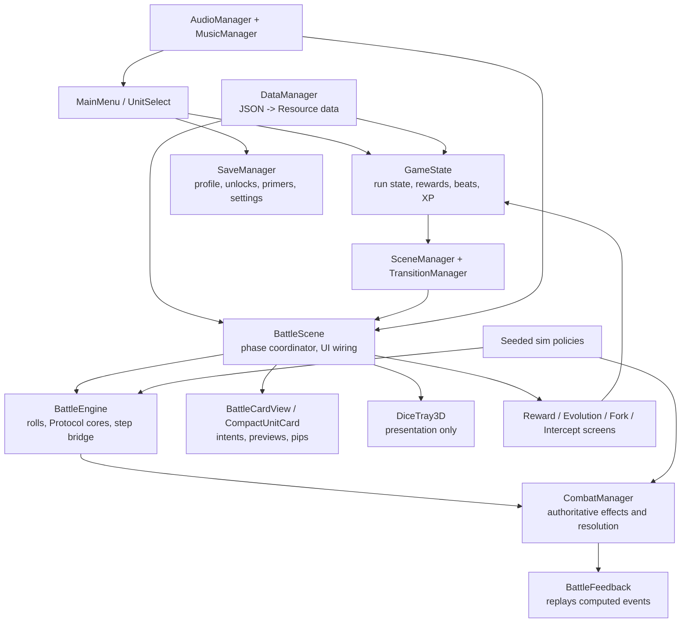

# Overload Protocol - Demo Readiness Audit

**Audited revision:** `041ca58c2bb75bf6030c0ba269e0d0a62ed89b93` (`main`, 2026-07-21)  
**Scope:** repository and runtime-readiness audit only. No game, data, scene, asset, or configuration changes were made.  
**Evidence:** live project configuration and source, canonical docs (`TRUTH.md`, `INVARIANTS.md`, `DECISIONS_RESOLVED.md`), data, prior audits, test harnesses, static checks, and the hard-gate output that completed in this session. Claims about player reaction, performance on hardware, and exported builds are explicitly marked as unverified because no external playtest, device lab, or release build was available.

## 1. Executive verdict

Overload Protocol has a real, distinctive tactical game at its center. The combination of visible D20 outcomes, a small shared Protocol budget, chosen hero firing order, and honest deterministic enemy intent is strong. It is more than a prototype: five operations, a sizeable roster, authored bosses, progression, rewards, first-sighting primers, and a substantial regression suite are all present.

It is **not ready for a public itch.io or Android demo today**. The best honest release tier is an **internal developer build**, moving to a **small friends-and-family Windows test** only after a short release-readiness pass. Do not market the five-operation campaign as balanced or mobile-ready until that pass is complete. A polished Facility-first vertical slice is the appropriate public-demo target.

What already works well:

- The core roll -> manipulate -> assign -> resolve loop is readable, tense, and specific to this game.
- Combat rules are deterministic and heavily regression-tested; content is substantially data-driven.
- The industrial terminal/pixel visual language is coherent and governed by useful layout, contrast, and pixel-snap rules.
- The game has unusually strong internal tooling: schema validation, visual captures, flow/tutorial smokes, ability audits, seeded simulation, and contract checks.

The five largest blockers to a strong public demo are:

1. **Release packaging is incomplete.** The only export preset is Android and still has a generic package id, blank name/version/icons, no demonstrated signed artifact, and no desktop preset.
2. **A live run cannot be resumed and app backgrounding is unhandled.** `SaveManager` intentionally persists cross-run state only; the project has no app pause/focus lifecycle handling. This is especially serious for Android.
3. **Difficulty cannot yet support a five-operation public promise.** The pinned 300-run L1 baseline ranges from 12.5% to 63.4% clear by operation, while the simulator's feature-parity boundary is documented inconsistently.
4. **Release evidence is absent.** There is no device matrix, exported-build soak, player telemetry/playtest protocol, crash reporting, feedback channel, credits/license inventory, or store asset pack.
5. **First-session clarity still needs human validation.** Tutorial and primers are thoughtfully built, but the first run can introduce dice bands, Protocol, cast order, targeting, statuses, rewards, evolutions, events, and boss rules in quick succession. Remaining unit-detail, tooltip, and copy tasks make this risk concrete.

## 2. Current game overview

### Actual player loop

The application starts at `MainMenu.tscn`, where a first-time player can choose the tutorial or continue to squad/operation selection. A new profile starts with Combat, Engineer, and Medic and Facility only. The player selects three heroes, optionally chooses an earned boss relic as a Starting Directive, then deploys into a ten-battle operation.

Each battle is round based:

1. Every living unit receives a visible D20 result. Physical dice are presentation; the seeded roll provider is authoritative.
2. The player may spend Protocol: Nudge (1), Reroll (2), Set (3), or use a consumable (normally 1).
3. Enemy intent is computed deterministically. The player chooses any required target and the assignment order becomes hero firing order.
4. Heroes resolve in that order, then surviving enemies, then end-of-round status ticks. Feedback replays the already-computed result.
5. Victory leads to rewards, an evolution/directive stop if earned, and sometimes a route fork or intercept. Defeat ends the run.

All five operations have ten battles. Their encounter skeleton is deliberately learnable: authored opening, a fixed faction teaching battle, generated-but-revealed slot encounters, and a boss/escort battle. Three random beats occur after battles 2, 3, 4, 6, 7, or 8; battle 5 contains the relic draft. Player-visible content is not merely planned: it is wired through the operation, reward, route-fork, intercept, evolution, and run-end scenes.

### Progression, recovery, and replay loop

Heroes gain battle XP from effective rolls and survival. At 100 XP, one eligible hero evolves after a win; additional evolutions wait for later wins. Consumables cap at four, relics at two, and the UI has an explicit discard path rather than silently deleting an over-cap consumable. Operation clears unlock the next operation and a boss relic; a battle-count/run-end ladder unlocks the remaining heroes and staged item pools.

The player fantasy is a small strike team forcing favorable outcomes inside hostile automated facilities: read the dice, choose an order, exploit a brief opening, and survive a deterministic machine response. It has a clear tactical identity, even though the broader world objective remains thinly communicated.

There is no money shop or separate facility-management layer in the live game. The in-battle Loadout menu is the consumable surface; gear, relics, and consumables arrive through rewards, route effects, and intercepts. "Facility" is an operation/faction, not a town or meta-progression hub.

### Content inventory and sufficiency

| Category | Implemented inventory | Audit assessment |
|---|---:|---|
| Heroes | 8, each with 2 evolution paths | Enough for a Facility demo; breadth is credible, but individual power and clarity need human validation. |
| Enemy kits / definitions | 37 kits / 38 definitions across 5 factions | Strong faction structure and bosses; three-enemy layout is the practical current ceiling. |
| Operations | 5 x 10 battles | Too broad to present as demo-ready until balance is measured; ideal source for a narrow vertical slice. |
| Consumables | 25 | Useful tactical variety; cap/discard flow is well defended. |
| Gear / relics | 31 / 35 | Enough build texture; cognitive load rises quickly without better comparison and playtest evidence. |
| Keywords / primers | 32 keywords plus first-sighting primers | Good discipline, but first-run teaching density is still high. |
| Screens | Main menu, squad select, battle, reward, evolution, route, intercept, unlock, run end, help/inspect/loadout | Full loop exists; detail/tooltip copy remains uneven. |
| Audio | 11 registered SFX files, 6 music loops | Functional foundation, but `revive.wav` and `summon.wav` are missing and faction music mapping is acknowledged as provisional. |

Strongest content: the Facility's shield/jam teaching, deterministic enemy personalities, bosses with stated standing rules, and the compact three-hero squad. Weakest/demo-risk content: the unvalidated later-operation balance, unfinished copy/detail surfaces, and broad event/intercept complexity that obscures the core hook in a first demo.

## 3. Architecture and system map

### Ownership and dependencies

- `DataManager` is the main content choke point. JSON schemas and runtime resources make new units, enemies, items, and operations relatively data-driven.
- `GameState` owns the active run: squad, encounters, rewards, item/relic inventory, events, XP, evolution queue, and progression stops. `SaveManager` deliberately owns only cross-run profile state.
- `BattleEngine` and `CombatManager` are the main rules seam. The live scene and simulator both call this path, preserving the determinism fence.
- `BattleScene` still coordinates phase state, targeting, scene transitions, runtime unit construction, UI building, Protocol presentation, dice presentation, and debug seams. `BattleCardView`, `BattleLayout`, `BattleFeedback`, and `ProtocolActions` are meaningful extractions, but it remains the principal coupling risk.
- `PixelUI` is a valuable visual-constant choke point. The code-built UI is consistent in principle, but it makes screens large, imperative scripts rather than inspectable scene composition.

### Architecture findings

The architecture is appropriate prototype debt for a focused demo, not a justification for an ECS rewrite. The existing architecture review correctly rejects a paradigm rewrite. The immediate maintainability concern is concentrated ownership: `battle_scene.gd` (3,054 lines), `combat_manager.gd` (3,069), `GameState.gd` (1,599), `dice_tray_3d.gd` (1,957), `PixelUI` (1,522), and several 1,000+ line UI scripts. Extract only stable seams with characterization tests.

There are also real legacy/dead-data signs: `battleEnemyScale` remains schema-required despite not driving Godot encounters, `trackHpScale` is loaded but unused, a `phase2.wav` exists but is not a registered SFX, and old audit/wiki references remain. These are maintainability and decision-quality issues, not immediate crashes.

## 4. Complete findings register

Severity: **Critical** = release-breaking; **High** = likely major player/product harm; **Medium** = material quality or maintainability risk; **Low** = polish/debt. Confidence distinguishes source-confirmed facts from observations requiring a real device or player.

| ID | Area | Finding and evidence | Severity | Player impact | Confidence | Recommended action | Demo blocker | Effort |
|---|---|---|---|---|---|---|---|---|
| R-01 | Export | `export_presets.cfg` has only Android; generic `com.example.$genname`, blank name/version/icons, and no verified artifact. | Critical | Cannot responsibly distribute as a public Android build; no declared desktop release path. | Confirmed | Create actual platform presets, package IDs, versioning, icons, signing/release build checklist, and install/launch smoke. | Yes | Small-medium |
| R-02 | Run persistence | Save docs/code state that persistence is cross-run only; `GameState` active run is not serialized. | High | Closing, OS eviction, or a crash abandons the run; unacceptable on mobile. | Confirmed | Either implement an atomic between-battle run checkpoint or scope the first demo to desktop and disclose no-resume behavior. | Yes for Android; no for short desktop test | Medium |
| R-03 | Mobile lifecycle | No application pause/focus/background handling was found in runtime scripts. | High | Dice/feedback/input could be left in an unsafe state on Android interruption. | Confirmed absence | Define pause/resume policy, pause safely at phase boundaries, and test calls/background/rotation on devices. | Yes for Android | Medium |
| R-04 | Balance | Pinned 300-run L1 baseline: Facility 63.38%, Hive 18.64%, Veil 30.77%, Void 24.56%, Accretion 12.50%; target is 25-40% skilled full clear. | High | Sequential unlocks can turn later operations into opaque walls; broad demo claim is not credible. | Confirmed metric; human meaning unverified | Establish a parity matrix, then tune in a measured pass against per-op and per-hero deltas; validate with people. | Yes for five-op public demo | Large |
| R-05 | Simulation evidence | Documentation differs on whether the balance harness represents items, summons, taunt/cloak, boss rules, and run features. Shared combat code is a strength, but policy/run parity remains unclear. | High | Tuning against a misunderstood model can make real play worse. | Confirmed documentation conflict | Publish a feature-by-feature sim/live parity matrix and add fixtures for excluded or intentionally abstracted systems. | Yes before broad balancing | Medium |
| R-06 | Onboarding | Tutorial (24 beats) and primers are robust, but normal play introduces many systems quickly; remaining UI backlog calls out concise copy, detail popup, tooltip revision, and scope readability. | High | New players may not understand why a result happened or how to value a reward. | High likelihood | Run five observed first-time sessions; revise only the proven failure points. Keep prompts contextual, not text-heavy. | Yes for public demo | Medium |
| R-07 | Audio | `AudioManager` registers 13 keys, while `assets/audio/sfx/` lacks `revive.wav` and `summon.wav`; music mapping comments call several faction assignments placeholder. | Medium | Important events are silent; atmosphere is less deliberate than the visuals. | Confirmed | Add/assign the two clips, audit all event hooks, then do a short mix pass on device/headphones. | Yes for polished public demo | Small |
| R-08 | Device/readability | Portrait canvas and safe-area tests exist, but no device matrix, performance capture, touch-target study, or small-device/long-session evidence exists. | High | Dense pips, modals, cards, and 3D dice may fail on the hardware the game targets. | Unverified concern | Test at least one small Android, one cutout Android, and a tablet; capture memory/frame time/input failures. | Yes for Android; should-fix for public desktop | Medium |
| R-09 | Desktop/accessibility | No `input` section is configured; controls are mouse/touch-centric and many buttons opt out of keyboard focus. No remapping, text scaling, color-blind mode, or accessibility review exists. | Medium | Limits desktop friendliness and excludes players who cannot rely on touch/color/long-press. | Confirmed scope gap | For a public PC demo, add basic keyboard navigation/escape and document minimum accessibility support; assess color-only status cues. | No for friends-and-family | Medium |
| R-10 | Release operations | No licenses/credits/provenance inventory, privacy notice, feedback link, crash reporter, changelog, or store asset set was found. No network permission is requested, which is good. | High | Cannot answer basic public-distribution, support, or asset-rights questions. | Confirmed | Inventory every third-party/AI/source asset, add credits/license/privacy text, version notes, and a feedback channel. | Yes for public demo | Medium |
| R-11 | Test evidence | The hard gate completed validation, contracts, reward/loadout, ability, unlock, flow, and tutorial stages in this audit. The aggregate run did not finish printing, and the local direct Godot probe was blocked before project initialization by the audit environment's `user://logs` restriction. | Medium | Current pass is encouraging but not final proof of all gates or physical dice behavior. | Confirmed limitation | Run `python scripts/verify_gate.py` plus DiceTrayPhysicsProbe in a normal developer environment and archive the complete logs with the release candidate. | Yes for public release | Small |
| R-12 | Architecture | Oversized orchestration owners remain despite good extractions. | Medium | Changes to targeting, feedback, or phase flow have a high regression radius. | Confirmed | Do not rewrite for the demo. Extract only a tested phase/state seam after the release slice is stable. | No | Large |
| R-13 | Data/doc debt | `battleEnemyScale`/`trackHpScale` are live data/schema debt; legacy audit findings and some old references remain. Docs pass consistency gates but still contain historical material that can mislead tuning. | Medium | Developers can tune fields that do nothing or revive superseded work. | Confirmed | Mark/remove dead fields in one schema/data/docs pass; maintain a compact current parity/release document. | No | Small-medium |
| R-14 | Visual UX | Current UI direction is coherent and recent tasks fixed intent indicators, previews, reward chrome, scope pips, and feedback. Remaining UI backlog: detail popup, inspect/tooltip refresh, copy rewrite, and clearer unit browsing. | Medium | The core is readable, but a player cannot yet effortlessly compare all choices or learn a unit before selecting it. | Confirmed backlog; on-device severity unverified | Complete the shared detail/inspect surface and test reward/evolution comparisons with new players. | Should-fix | Medium |
| R-15 | Content scope | Five operations, 38 enemy definitions, and 66 items/relics are enough for a commercial-looking surface, but their combined system load exceeds what is needed to prove the hook. | Medium | More breadth makes balance and onboarding harder before it makes the demo better. | High likelihood | Ship Facility-first, optionally with a clearly labeled unlocked preview; defer campaign promise. | Yes for scope decision | Small |
| R-16 | Narrative/identity | Faction, boss, item, and UI terminology support a cold industrial tone. The player receives operation/boss framing, but the larger mission and consequences remain sparse. | Medium | A run can feel like a sequence of systems rather than an operation with stakes. | High likelihood | Add one concise title/deployment premise and one run-end consequence line; do not build a campaign. | No | Small |
| R-17 | Analytics/playtest | Runtime has no player telemetry; only simulation JSONL and a choice-guard print stub exist. | Medium | No evidence of time-to-first-roll, Protocol understanding, deaths, abandonment, or choice quality. | Confirmed | Start with a consented playtest worksheet and local logs, not an online analytics service. | Yes before wider public release | Small |
| R-18 | Audio/settings | Audio mute/SFX/music volume persist and music crossfades are thoughtfully engineered; there are no graphics, language, control, or accessibility settings. | Low | Reasonable prototype settings, weak public-build options. | Confirmed | Add only settings validated by device testing; do not grow a settings menu speculatively. | No | Small |
| R-19 | Physical dice | Dice physics has a dedicated probe and 120 Hz/Jolt configuration, but this audit could not execute that probe because the environment blocked Godot logging before boot. | Medium | Dice are a presentation centerpiece; a visible regression would damage trust immediately. | Unverified in this audit | Run probe and manual 10-minute device session for freezes, collisions, release/grab, and interrupted roll states. | Yes for Android public demo | Small |
| R-20 | Historical debt | The July 7 interaction audit catalogues many closed items plus a residual dead/confusing/doc-debt list. Task Queue reports a later dead-code purge and many UI fixes. The residual list must not be treated as live bugs without re-verification. | Low | Reopening stale findings wastes time; ignoring genuine leftovers loses hygiene. | Confirmed | Reconcile the audit index once: mark fixed/superseded/unverified with the commit or current test that proves it. | No | Medium |

## 5. Gameplay, content, and balance assessment

### What supports the game's identity

- **Dice are state, not decoration.** The tray makes an abstract roll tactile while the seed fence preserves deterministic combat. Freeze-as-repeat is an especially legible rule.
- **Protocol creates a useful decision economy.** Costs 1/2/3 form a simple ladder from adjustment to gamble to certainty. The value is immediate because dice and enemy intent are visible.
- **Chosen cast order creates agency.** Assignment order becoming firing order turns targeting into a tactical plan rather than a series of isolated taps.
- **Enemy personalities are readable.** Deterministic targeting rules and standing boss rules invite counterplay rather than hidden-AI guessing.
- **The run has meaningful stops.** Rewards, relics, evolution, route forks, and intercepts give the player decisions beyond raw combat.

### Risks in the full-system loop

The system count is high for a first demo: dice zones, Protocol, target selection, cast order, shields, burn, roll manipulation, named statuses, gear, relics, consumables, events, evolution, directives, and boss rules all coexist. The one-keyword/one-manual-pick limits are good defenses, but the player still needs to compare unfamiliar effects under time pressure.

The current simulator is useful for regressions and relative tuning, not proof of human difficulty. The baseline also shows a likely role concern: Shield has the lowest recorded hero clear rate (19.63%) and Medic is also low (24.76%); this is a signal to investigate through shared fixed-seed and human play, not a mandate to buff either one in isolation.

Recommended demo design: Facility only, 30-45 minutes for a first clear attempt, three fixed starter heroes, the existing short tutorial, a limited but representative reward pool, and an obvious feedback route. This tests the hook directly without asking a new player to validate five difficult operations and a growing unlock tree.

## 6. Player journey, UX, and accessibility

| Journey point | Current experience | Assessment |
|---|---|---|
| First launch | Main menu offers tutorial; profile stores tutorial completion. | Solid entry, but needs observed first-use testing. |
| Squad/operation selection | Starts with three heroes and Facility; later choices unlock. | Clear scope, but unit-detail browsing/copy is still an open backlog item. |
| First battle | Visible dice, Protocol actions, intentional tutorial rig, enemy intent badges, preview model, primers. | Strongest experience in the project; density remains the main risk. |
| Targeting/order | Legal targets and assignment-order badges make the system explainable. | Good interaction model; needs hardware/touch validation. |
| Victory/rewards | Standardized reward/evolution/fork/intercept screens, item caps and discard flows. | Functionally mature; comparison/inspect clarity needs player validation. |
| Loss/restart | Run-end service record and progression unlocks exist. | Good loop closure; active run is lost on app exit. |
| Replay | Operation/hero/item unlocks and templates add variety. | Enough for a closed test; do not use unlock breadth as a substitute for balanced content. |

Accessibility assessment: contrast, font floors, pixel snapping, safe-area tests, and non-color status labels show unusually good awareness for a prototype. Missing work is systemic: keyboard support, remapping, text scaling, color-blind review, screen-reader semantics, and verified touch target/device behavior. For a demo, prioritize readable labels alongside color, keyboard escape/back on PC, and a tested Android touch baseline rather than attempting a large accessibility feature set blindly.

## 7. Theme, visual direction, and audio

The game consistently reads as cold industrial sci-fi: restrained dark panels, cyan/rust/faction accents, hard geometry, engraved dice, callsigns, machine factions, and terse operational language all support the title. It does not read like fantasy or a generic bright mobile roguelike. The strongest visual principle is restraint: filled plates rather than decorative outlines, green reserved for health/heal, strong borders only for selection or major events, and deliberate pixel snapping.

The identity is currently about **containing automated hostile systems through calculated tactical intervention**, not about a fully explained story. That is enough for a demo. The highest-return narrative addition is one clear deployment premise and a small victory/defeat consequence; adding a campaign would dilute the release pass.

For the demo visual system, retain the hard pixel geometry, limited cyan/rust/amber/HP-green roles, 4-design-pixel frames, integer-scaled icons, and restrained motion. Prioritize hit/death/heal/target feedback and readable effects over more decorative background art. Avoid new rounded UI, bright unrelated colors, generic fantasy labels, or additional status icon families.

Audio direction has the right architecture (SFX bus, voice pool, music bus, crossfade, user volume controls) but not the final asset coverage/mix. Completing the missing clips and making the faction music choices intentional is a small, high-return demo task.

## 8. Stability, tests, builds, saves, and release operations

### What is covered

The project has strong automated defense for a game at this stage: JSON/schema validation; documentation, knob, caps, component, effect-text, pool, reward, panel, and loadout contracts; a 250-pass-floor ability audit; unlock, flow, tutorial, primer, music, transition, duration, display, and protocol regression scripts; seeded simulation; and a dedicated dice physics probe. The hard gate completed its early and mid-suite stages successfully during this audit, including validation, contract checks, reward/loadout, ability, unlock, flow, and tutorial stages.

### What is not proven

- A complete release-candidate gate log from this exact revision.
- An Android or desktop exported-build install/launch/playthrough.
- Android backgrounding, notification interruption, device rotation, thermal behavior, frame pacing, or small-screen usability.
- A complete physical dice-probe result in this audit environment; the external engine was unable to create its `user://logs` file before project startup.
- Crash handling/reporting, player feedback collection, asset rights, privacy/credits, or release notes.

### Save and privacy posture

The save format is simple and defensive: malformed saves warn and fall back to defaults; old profiles merge onto current defaults. This is adequate for cross-run meta progression. It is not an active-run save system. The project makes no network calls and asks for no Android permissions in the current preset, so privacy exposure is low; a public build still needs an explicit privacy statement saying this.

## 9. Historical notes and backlog classification

Historical documentation was reviewed as evidence, not as an instruction to resurrect old plans.

| Source / outstanding theme | Current classification | Audit disposition |
|---|---|---|
| `TASK_QUEUE.md` balance TODOs | Still relevant | The only declared open lane; handle after sim parity and human test protocol are pinned. |
| `TASK_QUEUE.md` UI completed list | Completed, but needs release verification | Recent work closes intent badges, net HP previews, scope pips, feedback, and reward consistency; re-test on target devices. |
| `TASK_QUEUE.md` parking lot: 4-5 enemy half cards | Still relevant later | Not needed for the current three-enemy Facility demo. |
| `TASK_QUEUE.md` dot-to-burn rename | Superseded/contradicted | Live data/docs now predominantly use burn; reconcile the stale parking-lot entry rather than scheduling a second rename. |
| `UI_BACKLOG.md`: concise copy, unit details, inspect/tooltip work | Still relevant | These are the most valuable UX follow-ups after the release blockers. |
| `ARCHITECTURE_REVIEW_JUL2026.md` | Still relevant | Accept its incremental extraction guidance; reject an ECS rewrite. |
| `FULL_PROJECT_AUDIT_2026-07.md` | Partially superseded | Its Facility-first recommendation, release-evidence gaps, and balance caution remain valid; several listed UI/audio facts have since changed. |
| `audit/INTERACTION_AUDIT.md` | Mixed historical record | Its top section records many fixes/closed rulings. Revalidate residual dead/confusing/doc findings before action; do not count all 97 as live bugs. |
| Archive/offline-bundle docs | Superseded reference | Useful lineage only; `TRUTH.md` and current code win conflicts. |

## 10. Release plan and exit criteria

### Gate A - friends-and-family desktop test

1. Make a Windows export preset, real version number, icon, and release notes.
2. Run the full verification gate and DiceTrayPhysicsProbe outside the sandbox; archive logs.
3. Add `revive.wav` and `summon.wav`; check every SFX hook once.
4. Put a clear "work in progress / no active-run resume" note in the build if resume is not implemented.
5. Conduct five observed new-player sessions using Facility. Record: time to first roll, failed target/spend attempts, first use of Protocol, unclear effects, quit point, cause of death, and whether they would replay.

**Exit criterion:** the installer launches; no gate failure; one complete manual Facility run; no repeatable input/soft-lock issue; participants understand how to roll, target, spend Protocol, and choose a reward without developer explanation.

### Gate B - public Facility demo

1. Choose the run-resume policy and complete it or scope the demo to desktop explicitly.
2. Resolve simulator feature-parity documentation and balance Facility against human data, not a single global percentage.
3. Finish the unit detail/inspect and tooltip/copy pass based on observed confusion.
4. Create credits, asset/license provenance, privacy note, known-issues note, feedback route, screenshots, and a simple versioned changelog.
5. Test exported Windows build at minimum; for Android also test lifecycle, safe areas, touch, and install/uninstall on a small phone and a cutout phone.

**Exit criterion:** a new player can finish or meaningfully fail a 30-45 minute Facility run, explain the basic combat loop, and submit feedback; the build has a clear owner, version, legal/provenance record, and support path.

### Gate C - five-operation public demo

Only attempt this after all of Gate B and a measured full-operation balance pass. Every operation must have a documented intended difficulty, simulator/live feature contract, human success/failure data, and no progression wall that is unexplained to a player. This is a later target, not the next release.

## 11. Suggested next five tasks

1. **Release configuration:** add real Windows/Android export metadata and perform an exported-build smoke.
2. **Run integrity decision:** implement between-battle resume or deliberately limit the first demo to desktop.
3. **Facility playtest kit:** recruit five new players, run the observation script, and turn the results into a small findings list.
4. **Audio completion:** add revive/summon clips and finalize one intentional music mapping pass.
5. **Demo scope lock:** build a Facility-first content configuration and a one-page public-build checklist (credits, privacy, feedback, version, known issues).

## Appendix A - audit command record

Completed in this audit:

- `git status --short --branch` and `git log -1` - tree clean on `main` at `041ca58` before report creation.
- Repository inventory, source ownership/size inventory, schema/content inventory, export/settings inspection, save/lifecycle/input searches, asset-reference and audio coverage checks, historical-document review.
- `python scripts/verify_gate.py --skip-sim` - completed and printed PASS through validation, documentation/UI/pool/reward/loadout/ability/unlock/flow/tutorial stages before the aggregate stream ended; it is not recorded here as a full suite pass.

Attempted but not project-verifiable in this environment:

- Direct headless `DiceTrayPhysicsProbe.tscn` launch failed before project initialization because Godot could not open its external `user://logs` file in this audit environment. Treat it as an audit-environment limitation, not a game defect; re-run on the normal developer machine.
