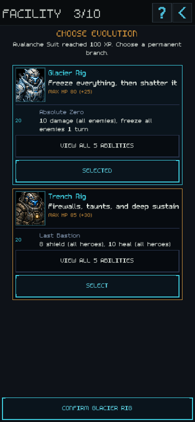
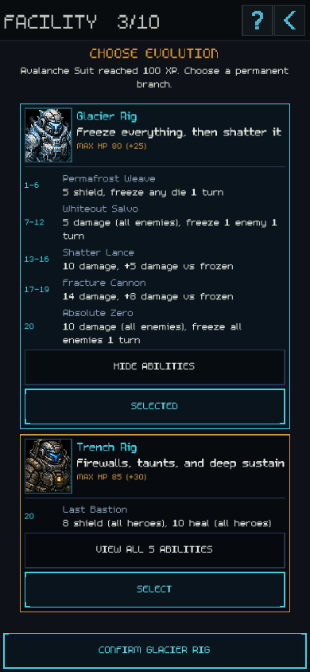
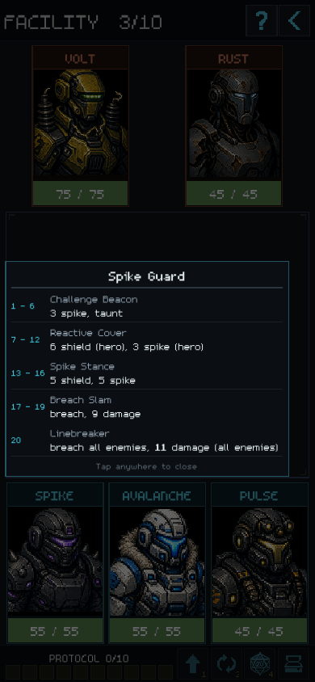
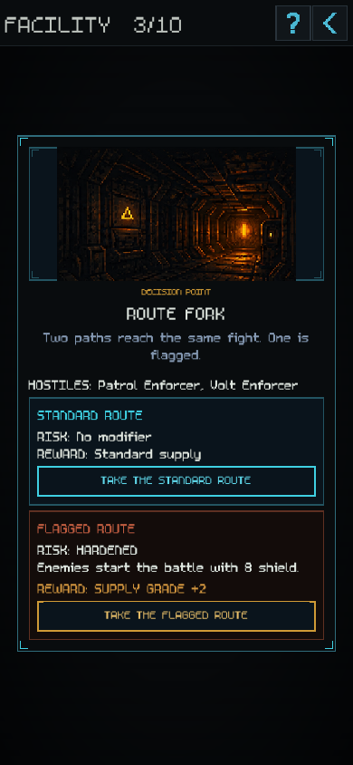
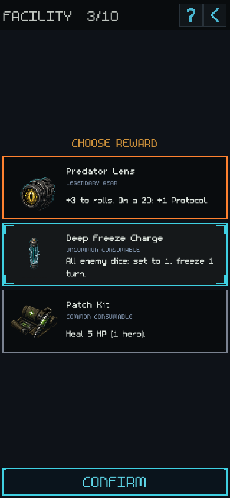
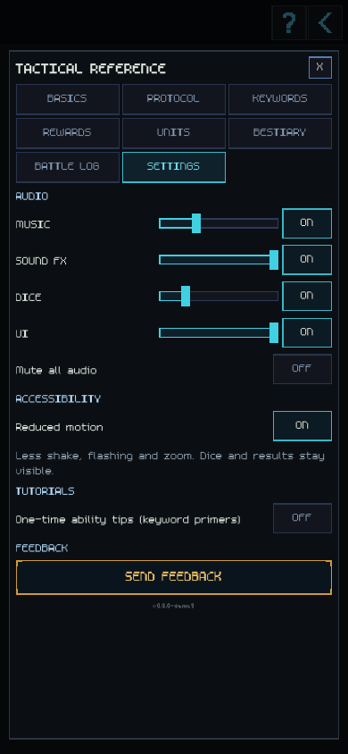
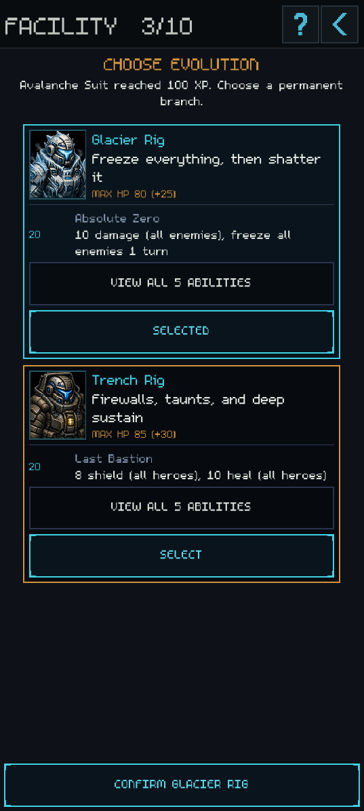

# Approved visual choices — 7 September 2026

V07, V08 and V12 are implemented under Kev's G-13 approval. This report supersedes the mockup-only status in the earlier visual pass. The visual bible remains the inventory entry point.

## Changes

| Item | Current behavior |
|---|---|
| V07 inspect | Existing long-press unit/ability popup. Fixed roll column, secondary ability name, bright left-aligned effect text; wider reading area. Full authored targets and durations remain. Status/gear sections and glyph-only fallback remain. |
| V07 evolution | Branch portrait, role and HP gain; 20 ability preview first. Each full five-ability kit expands independently. Select highlights the branch; a separate bottom Confirm applies it. New buttons have 128-design-pixel tap heights. Expanded content scrolls. |
| V08 route | Hostiles appear once when both lineups match. Changed lineups retain separate previews. Risk and reward have explicit labels; supply grade is prominent. Long choices can scroll. |
| V08 rewards | Bright names and effects for every rarity. Compact ordinary rows retain art, type/rarity, selection and confirmation. Effect text wraps without the previous two-line clipping. Relic ceremony, gear targets, swaps and Intercept workflows remain. |
| V12 | **? → Settings → Accessibility → Reduced motion.** Saved with the profile, default off. |

Reduced Motion removes board/card shake, lunges, strong screen washes, decorative bursts, title glitch/pulses and exaggerated number/name scaling. Damage numbers remain stationary while readable, then fade. Local hit tint is softened. The title exits with a short fade; scene transitions cut directly. Dice retain physics and final readable sizes, without the result zoom. Tutorial pointers hold a steady outline instead of pulsing. HP changes, targeting, status indicators, result numbers, combat timing and navigation remain. Active title loops respond immediately; subsequent battle effects read the preference when they start.

The prototype's comparison/font controls were presentation experiments; the game uses the approved summary-and-expand layout and its existing font system.

## Verification

Task: implement approved choice layouts and optional Reduced Motion. Constraints: no combat/data tuning, stable IDs, existing progression, shared PixelUI components, portrait layout, and G-11's compact battle footer. G-13 was recorded before runtime changes.

- Before-change `python scripts/verify_gate.py --skip-sim`: **all hard gates PASS**.
- After-change full gate: **all hard gates PASS**, including combat audit, flow/tutorial, dice physics, reward/equip/Intercept, safe-area, glyph and profile isolation checks.
- New gated `visual_choice_motion_test.gd`: persisted setting reload, title completion/live preference changes, readable stationary damage, no card shake, full-kit expansion, reversible selection, confirmation and continuation to a scheduled route fork.
- Reward regression now requires unclipped descriptions instead of the retired two-line cutoff.
- Rendered and inspected phone-size 390×844 screens and a 537×1195 desktop preview. Final focused checks followed the tap-height/copy adjustments. Existing missing revive/summon audio warnings remain.

| Balance report | Result |
|---|---|
| All five operations | Sim skipped: presentation-only change; no measured clear-rate delta. |
| Baseline | Unchanged. No balance baseline approval/update required. |

These are local Godot renders and regression results. Current exported-browser and physical-device validation remains V06.

## Evidence

The reproducible capture script is `docs/audit/visual-review-tools/approved_choices_capture.gd`; launch with Godot `-s` and a real renderer, using `--kind=evolution|expanded|inspect|route|reward|settings` and optional `--width=537`. Script execution isolates the player profile.

### Evolution summary and expanded kit

### Inspect, route and reward

### Settings and desktop preview

## Remaining

- **V06:** current release export and PC/browser/device checks, including safe areas, loading and audio.
- **V11:** title Tutorial/Feedback hierarchy and sparse unlock composition. Large unlock sets work; no unlock logic change is proposed.
- **Separate deferred task:** full tutorial redesign.

No release export, merge, push or public upload is part of this implementation.
