# Overload Protocol — UI & Visual Bible

**Review edition: 6 September 2026 · Game source: `364822d` · Intended showcase: itch.io PC demo, screenshots, optional short trailer.**

This is the current entry point for the game's visual language, inventory and visual review. It supersedes the older visual overview and review in `BATTLE_UI_V2_SPEC.md`, `UI_BACKLOG.md` and `audit/UI_REVIEW.md`. Those documents retain useful historical and implementation detail. This document incorporates the transition system previously described separately in `TRANSITIONS_SCOPE.md`.

**Authority:** current implementation is described as **Current**; changes are **Recommended**, pending Kev's selection. This review does not implement a redesign or override gameplay rulings, TRUTH, or INVARIANTS. The user's brief permits radical recommendations; it does not make every recommendation an approved implementation requirement.

## Implementation update — 6 September 2026

**Step 1 (V01–V05) is implemented.** [Changes, captures and verification](UI_STEP1_IMPLEMENTATION_2026-09-06.md). This update supersedes the corresponding recommendations below: Twin Fates is removed entirely; the four footer actions are restored to their original compact icon-only presentation after the labeled version overlapped friendly health bars (G-11); seven quick taps on the operation title unlock developer tools for the session. The default icon and inaccurate help are replaced. The full tutorial redesign remains step 2.

The ratings, original screenshots and inventory below remain the review snapshot of `364822d`, including the now-retired Twin Fates entry. Use the implementation report for the current state of these five changes. No new overall rating is implied by passing the implementation checks; public-device playtesting remains outstanding.

**Follow-up, 7 September:** V09 now uses matching orbital-device/emitter art; V10 bounds number floats to two portrait lanes; Continue has no icon. V07/V08 have interactive proposals in the conversation and are not implemented. V11 is narrowed to sparse award sets (reproduced), not large unlock screens or a functional failure. The Tutorial concern is visual hierarchy, not a disabled control. V12 remains an optional Reduced Motion proposal. [Follow-up report and captures](UI_VISUAL_PASS_2026-09-07.md).

## 1. Verdict and first step

**Overall visual presentation: 6/10. Keep the foundation; improve communication before replacing the art direction.**

The game looks like a coherent, dark sci-fi prototype with substantial finished artwork. Its strongest features are the large armored portraits, physical dice, hard terminal geometry, and readable health bars. Its weakest features are the small symbolic interface surrounding those strong features: unlabeled actions, low-contrast information, a crowded effect notation, and limited differentiation between some units.

The art generally fits a military sci-fi world with a restrained machine-cult influence. It occasionally slips into generic fantasy relics or interchangeable hooded cultists. It does **not** need a wholesale art replacement before an itch demo. A full redesign would cost a great deal while leaving the immediate comprehension problems unresolved unless those are addressed deliberately.

**Do first: one focused battle readability pass.** Preserve the visible number on frozen dice, make the footer actions identifiable, and establish the minimum readable size at the actual PC embed and phone viewport. Use the frozen-die evidence below and the 390-pixel capture as acceptance references. In the same pre-showcase tranche, replace the default application icon and remove public-facing developer controls.

This is ready for a clearly labeled work-in-progress conversation with players, but I would complete the release-critical list in §10 before giving it a prominent public push. I would prepare screenshots before investing in a trailer.

### Ratings

Scores judge visible craft, thematic fit and clarity together. **5** means functional but noticeably rough; **6** promising but uneven; **7** good and coherent; **8** polished; **9–10** exceptional. They are editorial judgments, not test results. The overall score is holistic, not a computed average.

| Bucket | Score / 10 | Judgment |
|---|---:|---|
| Overall UI composition | 6 | Clear battle structure; secondary screens range from dense to excessively empty. |
| Theme and palette | 7 | Navy, cyan, rust and amber work; weak contrast and overlapping semantic uses need attention. |
| Typography and information hierarchy | 5 | Pixel font suits labels but makes dense descriptions and small metadata unnecessarily tiring. |
| Base hero portraits | 7 | Strong rendering and consistent framing; too many similar armored heads. |
| Evolution portraits | 6 | Some excellent branches; several upgrades are hard to recognize at card size. |
| Enemy portraits and faction identity | 7 | Good individual subjects; Veil/Hive/Signal boundaries are insufficiently distinct. |
| Boss presentation | 6 | Art is attractive, but several bosses do not look substantially more important than ordinary enemies. |
| Gear, consumable and relic art | 7 | Most of the active set is strong; a few style, scale and meaning outliers are conspicuous. |
| Buttons, navigation and effect icons | 5 | Visually tidy but too dependent on learned symbols and long-press discovery. |
| Title logo | 7 | Usable identity with an effective reactor motif; secondary wordmark is fragile at small size. |
| Application/browser icon | 2 | `project.godot` still points to the default Godot `icon.svg`; not game branding. |
| Dice appearance and movement | 7 | The physical dice sell the hook; status shells compromise their most important information. |
| Combat animation and feedback | 6 | Functionally layered and restrained; small effects and overlapping floats weaken cause and effect. |
| Transitions and menu motion | 7 | Dither and power-down fit the terminal world; a good system to retain. |
| One-handed phone ergonomics | 4 | Bottom utility controls help, but common interactions span the entire height; small hit areas shrink further on phones. |
| PC showcase presentation | 6 | Playable portrait concept, but the actual browser container and first impression need release QA. |

## 2. Evidence and limits

The review inspected current source, all 24 mapped hero/evolution portraits, all 38 mapped enemy portraits, the 91 mapped equipment/consumable/relic images, the event set, current icon families, logo layers, and retained chrome variants. The [content index](visuals/2026-09-06/content-index.csv) gives every hero, evolution, enemy and item its current name, asset and review note. The [complete file index](visuals/2026-09-06/asset-index.csv) records **1,276 visual/resource files**, dimensions, transparency metadata, checksums and reference evidence. This includes source packs and legacy variants; it is **not** a claim that the game uses 1,276 artworks.

Current scenes were rendered in isolated Godot sessions with the Compatibility renderer. The [screen gallery](visuals/2026-09-06/README.md) includes title, first-run prompt, roster, battle states, tutorial, inspect, loadout, help, settings, rewards, equip choice, relics, route fork, evolution, starting directive, victory, defeat and unlocks. Briefing and intercept captures from the immediately preceding copy review are also included and labeled as reused evidence from this same source edition.

Animation evidence includes **16 timed sequences**: logo boot, flare, dice roll, damage, heal, shield, detonate, breach, death debris, 20 celebration, jam, rewrite, freeze, two transitions and a complete combat resolution. Storyboards were visually inspected; GIFs preserve the sampled progression. Sampling and screenshot I/O affect timing, so these are **not frame-rate or performance benchmarks**. Isolated effects are identified as such: a debris probe does not prove a complete death sequence, and a direct power-down probe does not imply that ordinary menu navigation uses the defeat transition.

The native layout was captured at **540×1200**, **390×844**, and **432×960**, with an additional simulated inset capture. These are layout probes, not Pixel or iPhone certifications. No physical one-handed test, latest-iPhone hardware test, color-blindness user study, or current exported itch build was performed. The local `build/web` files are dated 2 September, before the reviewed copy commit; they were not treated as the current game. The custom web shell and export settings were reviewed in source.

The required baseline `python scripts/verify_gate.py --skip-sim` passed all hard gates. Visual findings can coexist with passing functional gates. No gameplay or balance changes were made for this review.

## 3. Visual direction to preserve and strengthen

**Recommended direction: a damaged military command terminal controlling an expedition into hostile industrial and alien territory.** Practical human machinery forms the baseline; biological, crystalline and ritual technology becomes stranger as operations progress.

Use the StarCraft reference for readable faction silhouettes, equipment that explains a role, and strong value grouping. Use the Warhammer reference sparingly for weight, age, ritualized machinery and threat. Literal franchise designs are unnecessary. The game needs its own recognizable equipment and factions.

### Current foundation

| Element | Current owner / treatment | Recommended rule |
|---|---|---|
| Master tokens | [PixelUI](../scripts/ui/pixel_ui.gd); theme resource mirrors it | Keep one source. Record exceptions by surface, not by scattered hex colors. |
| Backdrop | `DT_FIELD_BG #07090b`, panels near black, navy hero surfaces | Retain subdued backdrop; strengthen focal subjects rather than globally brightening every surface. |
| Friendly/interactive | Cyan `#3fd0e2`; friendly names `#56c7d9` | Keep. Selected and actionable must be distinguishable without relying only on cyan intensity. |
| Hostile/damage | Rust `#c25d3f`, brighter damage red | Keep enemies warm, but use light text for important enemy rules. Rust text alone is weak when small. |
| Health/healing | Muted green HP `#57854b`, brighter heal symbols | Keep HP bars and numbers as the visual anchor. |
| Protocol/risk | Amber `#cf9a36`; gold reward/ceremony | Keep; use labels to separate resource, risk and rarity. Color cannot carry three meanings alone. |
| Rarity | Gray, blue, purple, orange | Keep the established ladder; no return to green rarity. Brighten names independently of the colored border. |
| Font | `m5x7.ttf`; discrete scaled sizes | Keep for callsigns, numbers and buttons. Prototype a more readable body face or a stronger pixel body treatment for inspect/help before choosing a migration. |
| Frames | Six component kinds, hard corners, four design-pixel frame width | Preserve this system. Reduce nested full frames where one filled grouping plate is sufficient. |
| Motion | Local impacts, physical dice, ordered dither, defeat power-down | Preserve semantic differences; do not add constant screen noise. |

**Documentation discrepancy:** the broad HP-only green rule in TRUTH/INVARIANTS does not describe every current pip. `EffectPip`/`PixelUI` render positive roll glyphs green; the live reward and battle captures confirm it. Gold Cleanse has its own explicit ruling. Treat this as an authority/exception item to resolve, not evidence that every green pixel is a defect. This review changes neither tint. Material colors inside portraits and objects are also distinct from interface signals.

The six existing component kinds are `normal_card`, `selected_card`, `enemy_card`, `reward_card`, `modal`, `major_event`. New implementation should use those contracts unless a new direction is explicitly approved. A new body font or different portrait crop would likewise require updating the relevant current contracts; this review does not silently authorize it.

### Typography and contrast

The central problem is less the amount of copy now than its layout. Ability rows often give icons a left column and put prose in a narrow, right-aligned column. This creates irregular line starts and makes even concise text feel choppy. Evolution is a particularly dense example.

**Recommend:** one left-aligned reading order: roll range and ability name, then concise effect text. Keep pips as a compact companion, not an equal competing paragraph. Preserve the approved syntax, including necessary targets and durations; do not shorten by removing meaning. Keep callsigns/headings/buttons uppercase and body sentence case.

Use bright neutral text for decision-critical effect descriptions. Reserve muted text for secondary context. Do not shrink text to make a fixed row pass a clipping check. Test the actual displayed glyph height at the final viewport, rather than equating the authored font size with a readable screen size.

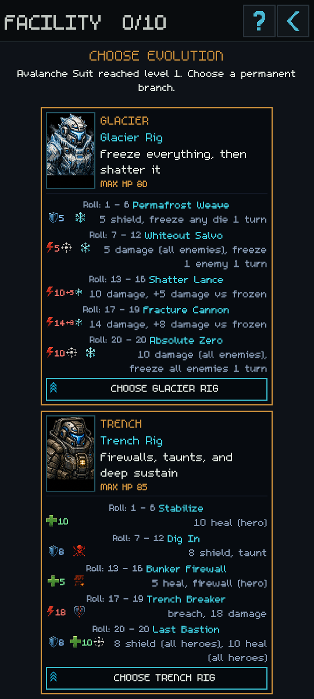

## 4. Portrait bible

### Heroes and evolutions

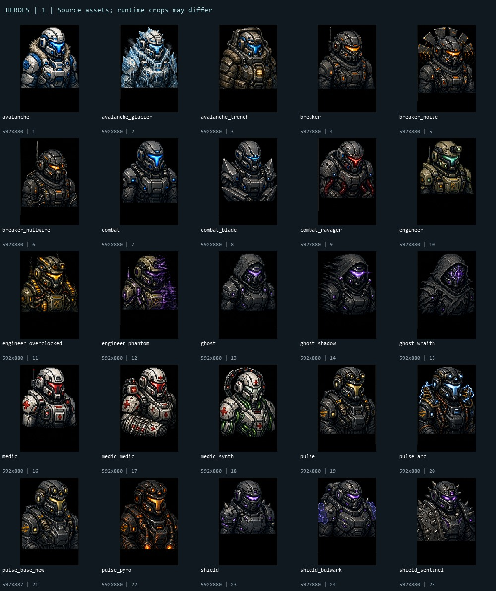

The roster has good rendering consistency. White Avalanche and Medic are excellent value anchors. Ghost's hood, Engineer's optics, and Ravager's red faceplate are useful identity cues. The recurring three-quarter helmet bust is also the main limitation: art can be individually attractive while the roster remains hard to remember.

**Art acceptance criteria, recommended:** identify a unit without its name at the battle crop; distinguish its two branches without relying only on visor hue; retain one clear silhouette feature inside the existing head/shoulder crop; keep the face as the strongest local contrast. Test source, roster, battle and inspect crops together. Do not repair weak differentiation by adding ever smaller machinery.

| Family | Base | Branches | Priority |
|---|---|---|---|
| Pulse Tech | Yellow face reads well, but overlaps Engineer's optics/metal | Pyro's heat and Arc's electricity are clear; retain larger effects, simplify filaments | Medium |
| Strike Unit | Good soldier baseline; generic blue visor | Blade Trooper too close to base; Ravager substantially clearer | Blade: high |
| Spike Guard | Purple armored head does not visibly promise spikes/counterattack | Bulwark communicates barrier; Sentinel's spikes communicate the role better than base | Base: high |
| Avalanche Suit | Best distinctive base: white mass and fur collar | Glacier and Trench have strong different materials and silhouettes | Keep |
| Splice Medic | White/red and medical marks communicate immediately | Combat Medic needs stronger distinction; Synth Medic's tubes/ring are effective | Combat Medic: medium |
| Field Engineer | Asymmetric optics are useful | Overclock needs separation from Pulse; Phantom should retain Engineer identity through the glitch | Medium |
| Ghost Operative | Hood is an effective visual anchor | Shadow is too similar to base; Wraith's face sigil is clear but close to fantasy occult imagery | Shadow: high |
| Signal Breaker | Orange visor distinguishes color, less so role | Noise crown is distinctive but crop-sensitive; Nullwire remains too similar to base | Nullwire: high |

Current framing is normalized offline and then adjusted by `PixelUI.cover_fit_portrait`, including a global 1.2 zoom and explicit exceptions. The established head-focused crop can remove antenna/crown identity; **put new identifying forms inside that crop first**. This avoids undoing the previous framing work just to accommodate a replacement asset.

The extra `pulse_base_new.png` on the source sheet is not one of the 24 mapped portraits. Do not accidentally promote a spare variant through filename inference.

### Enemies, factions and bosses

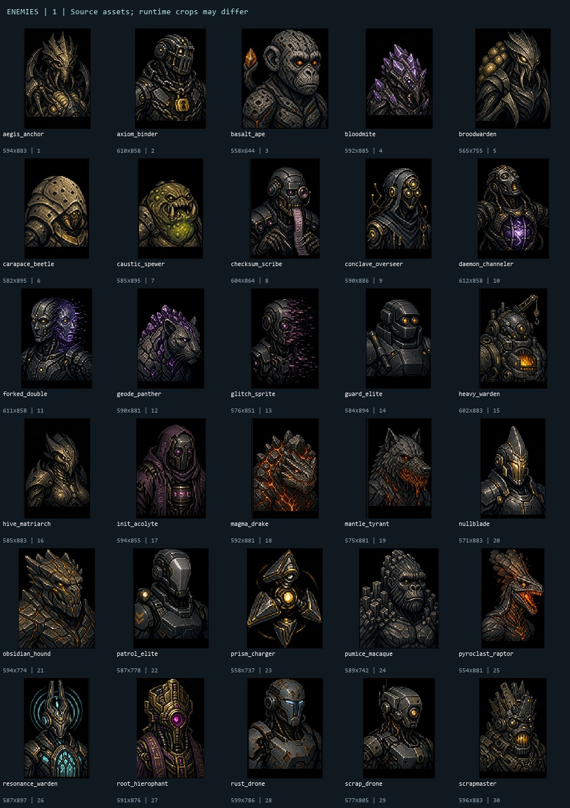

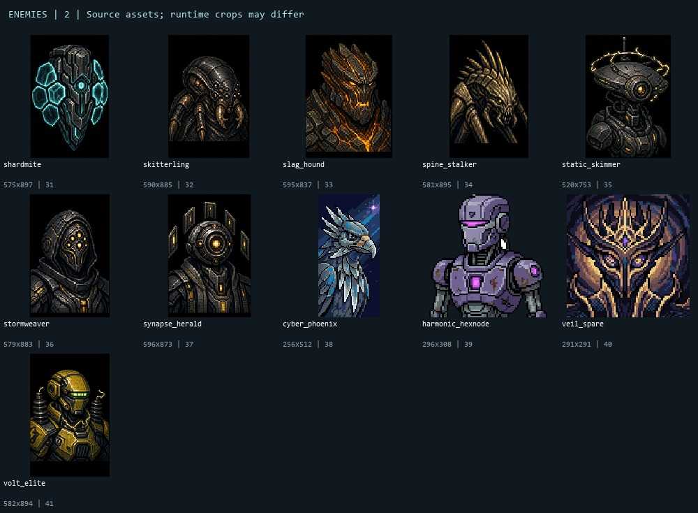

| Operation family | Strong anchors | What feels off | Recommended boundary |
|---|---|---|---|
| Facility Sweep | Scrap's exposed cables, Rust's corrosion, Heavy Warden's furnace | Several enforcers resemble friendly soldiers; shield/volt roles rely on small details | Built, repaired, riveted machinery; asymmetric tools and exposed workings. |
| Hive Incursion | Beetle plates, Spewer mouth, Broodwarden sacs | Bloodmite's purple crystals cross into mineral/energy factions; several insect busts read humanoid | Organic joints, sacs, chitin and mouthparts; asymmetry from growth, not machinery. |
| Veil Breach | Shard Drone, Prism Charger, Resonance Warden | Aegis Anchor resembles Hive Matriarch; Stormweaver and Overseer resemble Signal cultists | Luminous geometry, resonators, planar shields, deliberate symmetry. Highest-priority faction cleanup. |
| Signal Purge | Circuit Acolyte, Scribe, False Image, Hierophant | Gold hooded machinery overlaps too much with Veil | Hoods, masks, broken transmissions, circuit inscriptions; ritual technology belongs here most strongly. |
| Mantle Hunt | Raptor profile, magma fractures, crystal panther | Pumice/Basalt apes and Obsidian/Slag hounds can merge when small | Rock anatomy with unmistakably animal outlines; distinct glass, slag, basalt and geode materials. |

The strongest direct mismatch is **Aegis Anchor versus Hive Matriarch**: both use a narrow gold/chitin head. The biggest boss issue is **rank**. A boss should still read as exceptional when its card is no larger than everyone else's. Give each a clear crown, dominant mass, unusual face structure or framed rule signal, rather than relying on more surface texture.

Boss recommendations: keep Scrapmaster's furnace mouth and crown; strengthen Matriarch's brood silhouette; rebuild Overseer's silhouette around geometric resonance rather than another hood; retain Hierophant's circuit crown; increase Mantle Tyrant's jaw/edge separation so it does not read as another hound. Display standing rules clearly in the relevant encounter/inspect flow; do not invent a new boss phase UI.

The three portraits under `assets/portraits/enemies/unused/` are indexed but excluded from the current-art score. Each of the 38 mapped enemies has a separate note in the content index, including the two independently illustrated hounds.

## 5. Items, iconography, events and branding

### Gear, consumables and relics

Most mapped art belongs to a consistent detailed 128-pixel family. The source directory also contains older 32-pixel items. These must not be treated as though all are in the active game: **90 mapped item images are 128×128; Gravity Well is the mapped 32×32 outlier.**

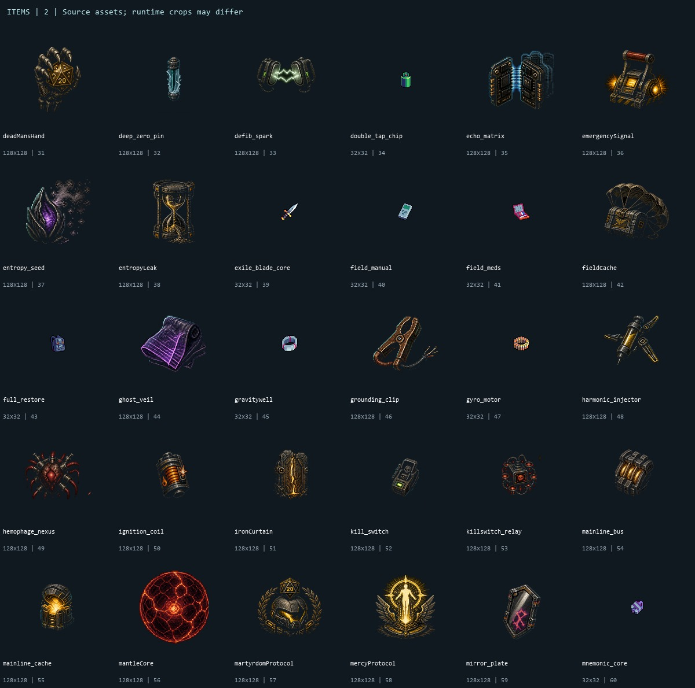

The detailed machinery mostly fits. It needs a clearer hierarchy: consumables should read as usable tools, gear as equipment, and relics as exceptional artifacts. Too many small golden devices have similar occupied area and value, particularly in the loadout.

| Asset / current name | Recommendation | Why |
|---|---|---|
| Gravity Well (`gravityWell`) | Replace the pastel ring with a matching technological gravity apparatus | A clear style outlier among the current relics. |
| Interference Charge (`corrosion_bomb`) | Replace the leaking green chemical bomb with a signal-interference device | Current effect lowers a roll; the old art communicates acid/poison. This mismatch survived the copy rename. |
| Twin Fates (`twinFates`) | Enlarge and simplify two linked dice | Fine chain and tiny objects leave the tile visually empty. |
| Attrition Field (`entropyLeak`) | Replace or reinterpret the hourglass as degrading machinery | Current name/effect is enemy starting HP attrition; a magic hourglass is no longer a clear cue. |
| Standing Order / Salvage Directive / Scavenger Manifest | Prefer stamped command or inventory plates over parchment | Reduce the generic fantasy inventory impression while retaining hierarchy. |
| Signal Interference (`signalJam`) | Increase silhouette thickness and occupied area | Fine antenna wires disappear in the small loadout. |
| Chain Doctrine | Enlarge central plate/book and simplify gold detail | Too dark and small compared with adjacent items. |
| Neural Splice / Mercy Protocol | Retain as limited grimdark/ceremonial accents | Skull and saint imagery can work; using it everywhere would change the game's center of gravity. |
| Patch Kit / Combat Plating / Predator Lens / Deep Freeze Charge | Keep and use as size/clarity references | Recognizable silhouettes and clear practical meaning. |

**Recommended icon specification:** one focal object or tightly connected group; consistent safe padding and occupied area across a category; one dominant value silhouette; no embedded microtext needed for recognition. Validate at reward size **and** small loadout size. Continue using the integer-scaling helper. A large source image is not automatically legible when reduced.

### Action and effect icons

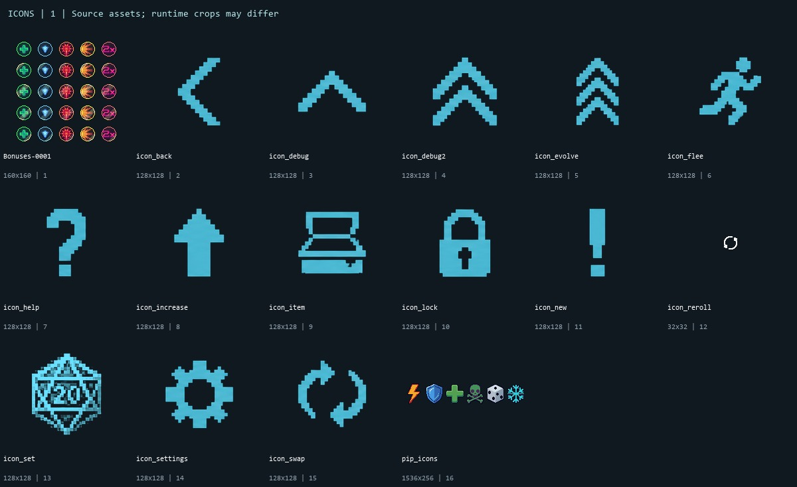

The action icons are crisp but not sufficiently specific. An up arrow can mean upgrade or move up; a bag-like shape can mean items or inventory; a numbered die can mean roll, set or inspect. **Twin Fates currently uses `ICON_DEBUG2`, a double-chevron also related visually to evolution. That is a player-facing meaning mismatch, not merely an unfortunate filename.** Give it two linked dice and an explicit copy cue.

Recommended footer treatment: short labels **NUDGE / REROLL / SET / ITEMS**, with cost immediately associated with the action. Keep the whole control touchable, visibly distinguish unaffordable from unavailable, and teach the additional Twin Fates action when acquired. Preserve its existing two-step source/destination selection and once-per-battle mechanics.

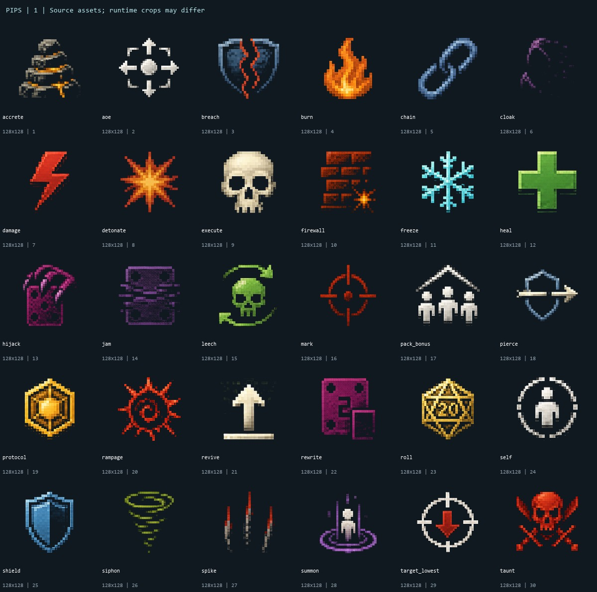

The 30 effect rasters cover a complex grammar; Cleanse deliberately reuses a tinted heal glyph. Freeze, heal, damage and shield are recognizable. Cloak, jam and spike are substantially weaker at small size. Self, group and lowest-HP scope modifiers add more symbols to decode. Duration superscripts can merge with magnitude: the current flame-plus-3-plus-small-3 is not self-explanatory to a new player.

Keep the concise pips for learned play, but give inspect text a predictable left-aligned syntax. Strengthen silhouettes for cloak/jam/spike and make the duration marker visibly distinct from the amount. Do not add a different symbol per ability: names can be unique while mechanical symbols stay shared. Preserve existing overflow access and make it discoverable; a `+N` marker alone is easy to overlook.

### Environment and event art

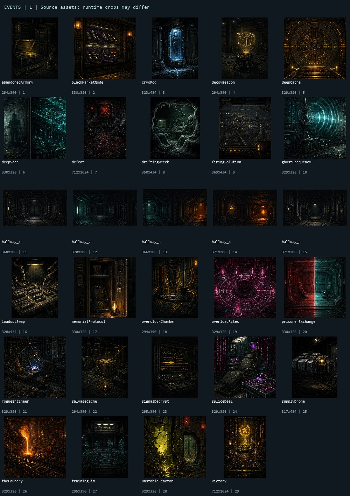

This is a consistent and atmospheric set: **22 intercept images, five corridor variants, and two run-end illustrations**. Cryo Pod, Splice Deal, the Foundry and Unstable Reactor have useful focal subjects. The corridor images establish industrial space but are very dark and similar. They are supporting images, not ideal lead screenshots.

Retain the set. Increase focal-subject separation selectively, especially for caches and workstations. Overload Rites' ritual circle is the most overt occult accent; keep it exceptional and tie it visually to the machine-cult world. Avoid adding candles and gold ornament to routine technical encounters. The outcome illustrations can remain ceremonial, but the player should see their results and next action without scanning past a dominant tall image.

### Logo and application identity

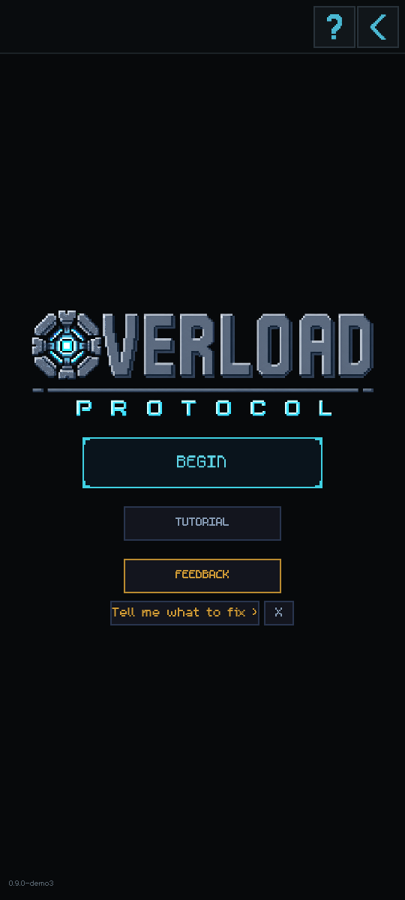

The active logo is the three-layer `TitleLogo.tscn` composition: `logo_base`, `logo_core`, `logo_protocol`. Keep the reactor replacing the first O and the industrial lettering. Its weakness is the widely spaced, thin **PROTOCOL** line at thumbnail scale. Produce a compact small-format lockup with a larger secondary word and reduced spacing. Validate at a real store-card size, not just the title screen.

The old `legacy-angular/public/ui/overload-protocol-logo.*` and `assets/ui/logo_scifi_overload_protocol.png` are alternatives/history, not the active identity. Keep that distinction in exports.

**Release-critical:** the project icon is still the default Godot face in [icon.svg](../icon.svg). Replace the application/favicon/apple-touch identity with the reactor mark as a dedicated square design. This is separate from replacing the title logo, which does not need a wholesale redraw.

## 6. UI inventory and screen review

Each row identifies a live surface or shared visual system, its implementation owner and its most useful next improvement. The asset CSV inventories files; this table inventories generated UI that has no single image asset.

| Surface / elements | Runtime owner | Evidence / recommendation |
|---|---|---|
| Title, BEGIN, TUTORIAL, FEEDBACK, first-run choice | `scripts/ui/main_menu.gd`, `TitleLogo.tscn` | Rendered. Tutorial looks quieter than feedback; promote onboarding above feedback in first-run hierarchy. Consider a short genre/hook line. |
| Persistent operation header, help, back, developer arrows | `scripts/autoloads/PersistentHeader.gd` | Rendered. Top controls are outside easy thumb reach; keep infrequent navigation there. Remove meaningless back affordance on title if it has no useful action. |
| Encounter carousel, boss thumbnail, level/threat, page dots | `scripts/ui/home_screen.gd` | Rendered. Good compact encounter block; keep original short threat. Clarify locked versus merely unselected state. |
| Eight roster tiles, selected-order badges, unit blurb, DEPLOY | `home_screen.gd` | Rendered. Good roster overview. Ensure tile order/selection badge remains clear without color alone. |
| Starting directive picker, no-directive choice | `home_screen.gd` | Rendered. Large text is good; every option has a strong cyan frame, reducing selected-state hierarchy. |
| Deployment slate, SITE/SITUATION/OBJECTIVE, ENGAGE | `operation_briefing_overlay.gd` | Reused current-source capture. Keep concise fields; consistent alignment matters more than extra lore. |
| Battle five-band layout, rails and tray | `scripts/battle/battle_layout.gd`, `battle_scene.gd` | Rendered. Keep architecture. Empty tray before rolling is functional space; do not fill it with decorative dashboards. |
| Hero/enemy cards, name, crop, HP, preview segments, order/target cues | `compact_unit_card.gd`, `battle_card_view.gd` | Rendered. Strong portraits/HP. Preview requires teaching; retain numeric current HP and avoid relying on color segments alone. |
| Dice, highlighted face, result docking, hit regions | `dice_tray_3d.gd` | Rendered/timed. Core differentiator. Frozen result must remain legible. |
| Ability readouts, target/scope markers, status chips, overflow | `ability_readout.gd`, `effect_pip.gd`, `compact_unit_card.gd` | Rendered. Reduce visual decoding burden; enlarge thin/low-value symbols before adding more. |
| ROLL / END TURN / continue state | `battle_scene.gd` | Rendered. Strong primary action; assess thumb reach in the full select-die/select-target cycle. |
| Protocol meter and cost badges | `protocol_pips.gd`, `battle_scene.gd` | Rendered. Amber resource is clear; small cost numerals and empty pips are weak when reduced. |
| Nudge, reroll, Set value slider, cancel/confirm, item targeting, Twin Fates | `scripts/battle/protocol_actions.gd` | Footer/Twin rendered; slider and uncommon confirmation variants source-reviewed. Label actions and explain the current picker subject. |
| Inspect header, ability table, gear list, enemy targeting/rules, dismissal | `inspect_popup.gd`, `inspect_resolver.gd`, `long_press_input.gd` | Rendered. Weak name contrast and right-aligned effect wraps; long-press needs teaching. |
| Loadout items, relic rows, discard, item rejection flash | `loadout_menu.gd` | Main view rendered; discard/rejection structure source-reviewed. Bottom anchor is useful; communicate scroll and empty slots without wasting large vertical gaps. |
| Tactical reference tabs, bestiary, units, keywords, battle log | `help_menu.gd` | Basics/settings rendered; remaining tabs source-reviewed. Keep one reference hub; shorten browsing distance and brighten useful text. |
| Settings: audio sliders, primer toggle, feedback, developer controls | `help_menu.gd` | Rendered. Dev unlock/reset controls are explicitly built outside the debug-only section. Hide them from the public distribution. No reduced-motion control found. |
| Tutorial hints, spotlight, keyword primer queue | `tutorial_controller.gd`, `spotlight_layer.gd`, `keyword_primer.gd` | Tutorial rendered; spotlight animation source-reviewed. Keep focus on one interaction and preserve readable context. |
| Reward rows, rarity, item art, pips, selection footer | `reward_screen.gd`, `item_card.gd` | Rendered. Compact copy fits the inspected rows; common/uncommon names are too subdued. |
| Equip picker and capacity/discard handoff | `reward_screen.gd`, `loadout_menu.gd` | Equip rendered; capacity handoff source-reviewed. Show relevant existing gear context before a choice. |
| Relic draft and ceremonial card | `reward_screen.gd` | Rendered. Keep a ceremonial distinction, but normalize icon occupied area. |
| Route fork, modifier/reward descriptions, route buttons | `route_fork_screen.gd` | Rendered. The key risk/reward copy is smaller and dimmer than the repeated enemy listing; reverse that emphasis. |
| Intercept image, flavor, short action, consequence, decline, scroll | `intercept_screen.gd`, `choice_screen_guard.gd` | Current-source captures reused. Keep separated action/consequence; avoid art consuming the space needed to compare choices. |
| Evolution comparison, five abilities per branch, permanent choice | `evolution_screen.gd` | Rendered. Dense and hard to compare; show branch differences first, full detail on demand. Preserve informed choice. |
| Post-evolution directive choice | `evolution_screen.gd` | Source-reviewed. Apply the same comparison and concise-text rules; no unverified claim of full runtime coverage. |
| Victory/defeat art, run/service record, CONTINUE | `run_end_screen.gd` | Rendered with synthetic statistics. Strong mood; long full names and repetitive stats crowd the lower panel. Synthetic battle-0 values are harness setup, not a diagnosed game bug. |
| Unlock categories, new item/unit/op/relic tiles, scrolling | `unlock_screen.gd` | Single-award state rendered. Three tiny unlocks sit in a huge mostly empty frame; size the celebration to its content. |
| Feedback dialog, post-run nudge | `feedback.gd`, `main_menu.gd` | Nudge rendered; form not submitted. Keep subordinate to play/onboarding. |
| Backdrops, dither, six frame kinds, icon scaling | `pattern_background.gd`, `pixel_ui.gd`, theme resource | Source and asset review. Older metallic frame mockups remain indexed history, not a mandate to add chrome. |
| Cover dissolve and defeat power-down | `scripts/autoloads/TransitionManager.gd`, two shaders | Timed/rendered. Preserve distinct meanings and input blocking. |
| Browser loading/progress/error UI and canvas wrapper | `web/shell.html`, Web export preset | Source-reviewed. Default loading/error language and responsive canvas need a branded, clearly recoverable first-load experience. |

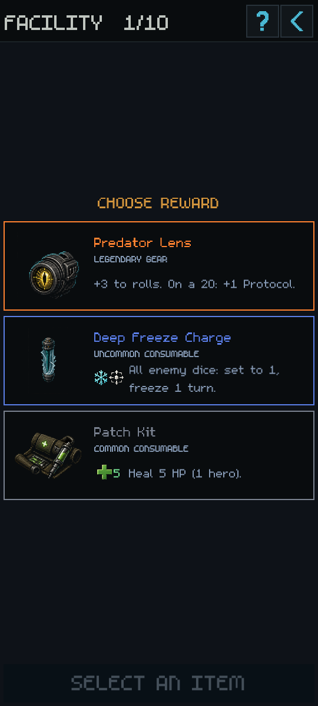

### Specific screen concerns

**Help accuracy is a release issue:** the rendered Basics page says heroes earn XP by dealing damage, healing or applying effects, and mentions a level-based progression story. TRUTH describes the win/average-effective-roll formula and deferred evolution. Audit the actual help strings against current progression before capture/publication. Do not rely on the copy workbook as proof that every hard-coded help string was covered.

**Inspect needs layout work:** names inherit subdued accents, and effect rows are visually fragmented. The short text is no longer the primary problem. A consistent reading order will help more than deleting target information.

**Route fork needs hierarchy work:** the modifier and supply benefit are the deciding information, yet are visually subordinate to enemy names already repeated in both alternatives. Make risk and reward the two strongest lines after the route title.

**Unlocks need proportional layout:** in the single-award capture, three small items float in a very tall empty panel. This looks unfinished even though nothing clips. Use a compact centered award block or larger hero item tiles for small awards; retain scrolling for a large award set.

## 7. Animation bible

**Rule to preserve:** movement should tell the player what acted, what changed, and when control returns. Extra motion should earn its place by improving that sequence.

The [animation function index](visuals/2026-09-06/animation-functions.csv) lists 48 presentation-related source functions. These are functions, not 48 separate authored animations. There are no required skeletal character performances hidden behind the portraits: the combat presentation relies on card movement, flashes, health changes, numbers, particles and dice states.

| Family | Current behavior / owner | Review and recommended direction |
|---|---|---|
| Logo boot | Fade/scale over ~0.55s, core ignition, wordmark warm-up; `title_logo.gd` | Keep. Strong small payoff; do not lengthen the time before play. |
| Logo idle / glitch / flare | Core pulse 2.1s; wordmark pulse 3s; occasional 5–9s glitch; ~0.3s exit flare | Keep restrained. Idle/glitch timings source-reviewed; boot/flare sampled. Include in a reduced-motion option. |
| Physical roll and docking | Real D20 tumble, settle and organized result positions; `dice_tray_3d.gd` | Keep; this is the visual hook. Ensure results stay crisp while changing status. |
| Result/pip reveal | Fade in readouts; `ability_readout.gd` | Keep and synchronize with readable settled values. Never reveal information before its event. |
| Actor lunge / target recoil | Local movement; lunge 26 design px, 0.08s out/0.16s back; `battle_feedback.gd` | Useful restraint. The actor cue could be easier to follow than several simultaneous numbers. |
| Damage/heal/shield numbers | Large outlined floats, nominal 1.5s lifetime, initial hold, stacking | Better than the older tiny-text design. In a complete round, stacked damage can reach the top header. Keep floats inside a reserved region and cap concurrency. |
| HP drain and delayed loss segment | Animated current/forecast fill; `compact_unit_card.gd` | Keep; stronger communication than extra sparks. Current HP must remain accurate throughout. |
| Hit pause / 20 celebration | 0.04–0.09s hit pause; brief 0.35-scale slow-motion; gold wash and board shake | Keep a special 20 beat, but avoid repeated global disruption on echoed/frozen 20s. Add user control over nonessential shake/flash. No mechanics change proposed. |
| Burn/detonate/spike | Status chip, ember burst and small local particles | Coherent colors, but some isolated bursts are extremely subtle at phone size. Increase meaning/contrast, not particle count indiscriminately. |
| Shield block/breach | Hex flash, ring and angular shatter slivers | Good conceptual distinction. The small shatter disappears quickly; connect it to visible shield loss. |
| Death | Gray state, local debris and die removal during combat | Keep disappearance/state change as primary signal. Isolated debris is subtle; full fatal resolution still needs a dedicated export recording. |
| Freeze / petrify | Translucent mesh crust plus 3D status labels | **Highest-priority motion/state issue:** the sampled frozen face loses its bright number and becomes hard to read. Preserve face contrast over the shell; verify the status marker at actual scale. Petrify is source-reviewed only. |
| Jam | Three short tint flickers and a cap marker | Weak in isolated sampled frames. Needs an exported-browser check for a readable persistent cap after the flicker. |
| Rewrite / hijack | Scrambling/pending labels and a drifting effect cue | Pending-state visibility matters more than the scramble. Do not let it obscure the current value or imply it already changed. Hijack is source-reviewed only. |
| Cloak/decloak | Portrait state/sharpness cue | Preserve silhouette and distinguish unavailable targeting from death. Source-reviewed. |
| Chain/leech/siphon | Numbers, paired heal, or resource drift | Keep the established decision against disruptive cross-board tracers. Make source/destination change legible through timing. |
| Summon/rebuild/revive | Entry/state refresh via battle orchestration | Source-reviewed; not individually witnessed in this pass. Public trailer capture must verify the arrival, revived HP and associated dice, rather than imply portrait art is animated. |
| Tutorial focus | Pulsing spotlight ring (~1.1s cycle) | Keep; do not dim the information currently being taught into illegibility. |
| Unaffordable item feedback | Brief local color rejection; `loadout_menu.gd` | Add a readable reason if missing in the relevant state; a red flash alone is insufficient explanation. |
| Evolution/reward/unlock | Predominantly static compositions plus scene transition | Avoid costly cinematics before clarity work. A short portrait-to-portrait evolution reveal could be useful later, without delaying choice. |
| Dither cover | ~0.27s out/cover/in | Keep. It unifies the terminal world and conceals the scene swap cleanly. |
| Defeat power-down | ~0.8s collapse and reveal | Keep its defeat-only meaning. The probe invokes it directly for inspection, not through normal menu flow. |

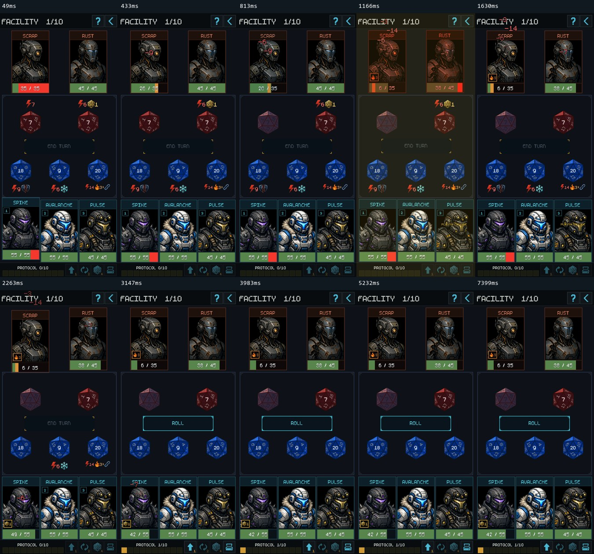

[Play the sampled complete round](visuals/2026-09-06/motion-round.gif) · [Dice roll](visuals/2026-09-06/motion-dice.gif) · [Dither transition](visuals/2026-09-06/motion-dissolve.gif) · [Power-down](visuals/2026-09-06/motion-power_down.gif)

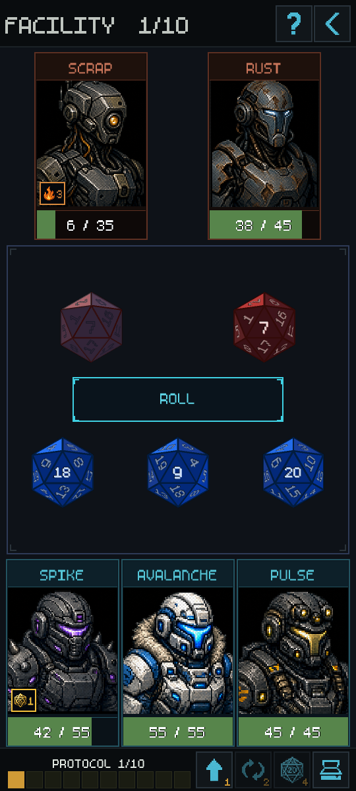

The frozen-die observation was reproduced during the **real complete-round resolution**, not only through an isolated visual setter. It is a Compatibility-renderer finding; verify the cause and the Web/mobile renderers before attributing it to a particular material or claiming every platform is affected.

No reduced-motion setting was found in the current Settings implementation. Recommend a control covering optional shake, logo glitch and strong wash while retaining essential event ordering. This is a polish/accessibility requirement for the next presentation pass, not evidence of a measured photosensitivity threshold failure.

## 8. Phone and PC layout standards

### One-handed phone use

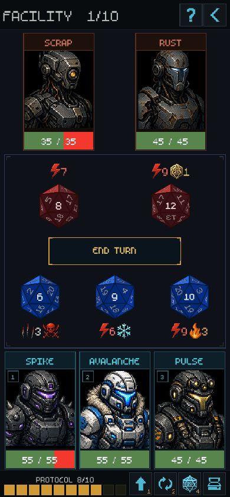

The battle is touch-oriented, but **touch-oriented is not the same as comfortably one-handed**. Hero dice are in the lower half; enemy targets and their inspect surfaces are near the top. Frequent interactions require reaching across most of the screen. All utility actions are clustered at the bottom right, which also favors the right hand.

The footer's `112×112` design-pixel buttons become **56×56** at the standard 540-wide preview and approximately **40.4×40.4** at 390-wide scaling. Their nominal size in source therefore conceals a small-target issue. Platform guidance is generally **44×44 points for Apple** and **48×48 dp for Android**; these units must be validated in the actual platform/container and must not be confused with high-density hardware pixels. See [Apple button guidance](https://developer.apple.com/design/human-interface-guidelines/buttons) and [Android touch-target guidance](https://developer.android.com/guide/topics/ui/accessibility/views/apps-views).

**Recommend:** reserve more logical height/width for the footer at narrow sizes; use whole-button hit areas; keep action labels and cost legible; test both hands. Test a lower, temporary target chooser that mirrors legal upper-board targets after selecting a die, without adding a second manual component or changing target rules. This is an interaction proposal requiring review, not a change to the portrait/no-scroll battle contract.

Keep long-press for secondary inspection, but teach it and provide an obvious path from Help. Do not require precise gestures just to understand a newly acquired item. Important targets must not sit under a gesture bar, cutout or browser control. The inset probe is useful evidence, not a substitute for a real device grip test.

### PC and itch.io

Preserve the portrait game. The main PC issue is **how that portrait is hosted and scaled**, not a need to create a landscape battle mode. The 540×1200 development preview is taller than a 1080-high display even before browser chrome. Use a height-fitting portrait container, with neutral side gutters and an accessible fullscreen control. A proposed 396×880 or 432×960 play area can be tested on common desktop windows; the latter has a native capture in this review. Smaller dimensions require their own text/hit-target checks.

The current custom shell fills a canvas and includes audio/debug instrumentation; the Web preset uses adaptive canvas resizing. The release checklist must verify the actual iframe, fullscreen, resize, focus, loading and return-to-page behavior. Native screenshots do not prove these work in the current export. Itch launches mobile HTML games in fullscreen and gives them a dynamic viewport, so hard-coding a handset pixel resolution is insufficient. [Itch HTML5 documentation](https://itch.io/docs/creators/html5).

### Proposed acceptance matrix

| Context | Review evidence now | Required before claiming support |
|---|---|---|
| Standard 540×1200 preview | Broad scene captures and timed feedback | Use as art/layout reference, not desktop-fit proof. |
| 390×844 portrait | Native battle capture | Read all five dice, costs and statuses; no tiny controls or clipped modal copy. |
| 432×960 portrait / PC container candidate | Native battle capture | Repeat overlays/evolution/reward QA at this size, then test actual browser embedding. |
| User's Pixel handset | Simulated portrait/inset evidence only | Physical grip, gesture area, brightness, audio and full run in intended browser/build. |
| Current iPhone target | No hardware claim | Confirm the chosen device/browser; physical safe-area, dynamic browser chrome, text and one-handed checks. |
| 1080p PC browser | Shell source reviewed; current export not run | Real itch or equivalent iframe at normal zoom and fullscreen; mouse discovery, resize and short-height window. |

## 9. Screenshot and trailer direction

**Recommended first public package:** one coherent cover image and four to six screenshots. Use actual game visuals and clear work-in-progress framing.

1. **Lead:** a populated battle after dice settle, with readable values, an interesting enemy lineup and a clear next action. Do not lead with the empty pre-roll tray.
2. **Roster:** distinctive heroes and a meaningful encounter selection. This sells squad building and the character art.
3. **Decision:** an improved evolution or reward comparison. This proves there is a build-making game behind the dice.
4. **World:** Cryo Pod, Splice Deal or another event with a strong focal object and concise choice.
5. **Threat:** a boss battle once boss identity and rule presentation are clear.
6. **Payoff:** a readable 20/chain consequence frame or victory, if it communicates without animation.

For a horizontal store image, pair a readable portrait screenshot with a restrained title/one-line hook in the side area. Do not stretch the game or shrink a full 1200-high interface until its text becomes texture. Keep screenshots honest about gameplay; label any composite or explanatory callout as presentation.

A **20–30 second trailer is useful after the readability pass**, because real dice motion and action consequences are hard to show in stills. Suggested sequence: a recognizable squad → physical roll → a visible tactical adjustment/target → a 20 and clear consequence → one evolution/reward → title and play call. Show gameplay in the first few seconds. Avoid a long logo intro, repeated empty tray shots, tiny tooltip walls, or a montage of portraits that implies fully animated characters. Record the release export and verify audio rather than using these sampled GIFs as trailer footage. [Itch page design guidance](https://itch.io/docs/creators/design).

## 10. Prioritized work before public showcase

### Release-critical

| ID | Work | Why first / acceptance | Scope |
|---|---|---|---|
| V01 | Preserve frozen/petrified die number and readable status | A player must read retained value as clearly as an adjacent normal die. Reproduce freeze in live combat on the release renderer; verify jam/rewrite overlays too. | Small–medium rendering/UI fix |
| V02 | Finish the footer at the actual target size | Labels/costs readable; minimum hit areas verified in real container; Twin Fates gets a meaningful symbol and source/destination prompt. | Medium UI pass |
| V03 | Replace default application/browser icon | Reactor mark appears in exported icon/favicon/touch icon; title identity is consistent. | Small asset/export pass |
| V04 | Remove public developer controls | No unlock/reset/debug tools in normal release Settings; deliberate public reset, if wanted, is clearly separated and designed. Current dev controls are not protected merely by the DEBUG section below them. | Small release UI pass |
| V05 | Correct hard-coded onboarding/help discrepancies | XP/evolution explanation agrees with TRUTH and actual runtime. Fresh player can explain how progression works. | Small copy/runtime review |
| V06 | Export and test the current itch candidate | Reviewed source, exported package and captured screenshots are the same edition. PC embed fits; mobile fullscreen/safe areas/load/audio checked. | Release validation |

### Strongly recommended before promotional screenshots

| ID | Work | Acceptance |
|---|---|---|
| V07 | Inspect/evolution reading order and contrast | Left-aligned concise effects; no target/duration loss; easy branch comparison at actual display size. |
| V08 | Route-fork and reward hierarchy | Risk/reward dominates repeated context; common/uncommon names remain readable. |
| V09 | Fix active art outliers | Gravity Well matches the set; Interference Charge depicts its role; Twin Fates has adequate occupied area. |
| V10 | Bound combat float stacking | No damage pile climbing through the operation header; actor and outcome remain identifiable during a multi-effect 20. |
| V11 | Improve title/onboarding and small unlock composition | Tutorial does not look disabled relative to feedback; small unlock awards do not float in a mostly empty full-height box. |
| V12 | Provide optional reduced motion | Essential state remains; shake/glitch/wash can be reduced. |

### Later art direction investment

Rework Spike Guard, Blade Trooper, Shadow Operative and Nullwire first. Then separate Veil from Hive/Signal, strengthen Matriarch/Overseer boss rank, and normalize relic silhouettes. Prototype typography and one-handed targeting before committing to broad replacement. Keep the existing logo, main palette, strongest portraits, event set and transition language unless that prototype proves they are the limiting factor.

A full redesign remains an option, but it should have a testable purpose: improved comprehension and identity at the final display size. Replacing every frame and portrait without proving those gains would be difficult to justify from this evidence.

## 11. Maintenance and closeout

For future visual changes, update this bible's current/recommended distinction, the relevant content-index row, and the affected screenshot. Keep stable game IDs separate from display names and filenames. Never delete a file merely because the literal-reference scan finds no usage; convention-based loading and retained source packs exist. Do not revive Angular application code.

The complete file inventory includes source-pack assets under `assets/icons/new icons/`, PNG/WebP alternatives, probe images, font/theme/shader resources and the root application icon. They are indexed for traceability, not approved for runtime use or individually scored as current art. Audio clips and nonvisual source files are outside the visual-file count; animation ownership is indexed separately.

**Task record:** context read in required order; untouched-source fast gate passed; constraints preserved (portrait layout, stable IDs, combat determinism, existing rulings); change consists of documentation and derived visual evidence; verification includes all 153 content mappings resolving, capture dimension checks, image inspection and link checks. After harness correction there were no script errors in the final capture logs; first-run/roster teardown still reported resources in use, and the existing missing revive/summon audio warnings remain. These are not presented as newly diagnosed visual defects. No new balance result or baseline update is applicable. No redesign, deployment, main merge, or push is part of this review.

The recommendations above are the review output for Kev to select. The first implementation candidate is **V01–V06**, with V07–V11 shaping the screenshot pass.
